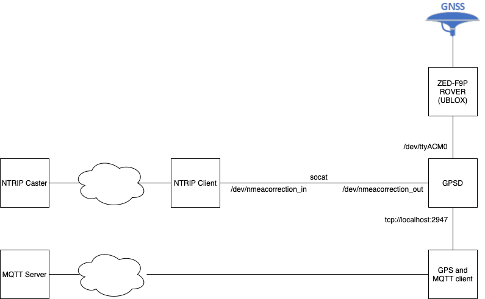

# setting up rtk using GPSD

GPSD can connect to the gps device and provide localisation data to different applications. To enable rtk, the GPS device also needs to receive NMEA correction data. In this case the RTK data is received over NTRIP using virtual streams. To enable this the NTRIP client also needs to send the location data to the NTRIP server. This is done by providing a $GNGGA nmea sentence to the NTRIP server.

It seems that the build in ntrip client of GPSD does not provide the needed nmea sentence towards the NTRIP server. To overcome this a separate ntrip client is needed. 




In this setup for the NTRIP client an ntrip client is used from https://software.rtcm-ntrip.org/. This client supports sharing of NMEA data towards the NTRIP caster. This is however still not the best solution since this NTRIP client does not support dynamic NMEA messages.

In the follow up the folling components are described:
- socat (to enable an interface between the ntrip client and gpsd)
- ntrip client
- gpsd

## Socat

To share a serial interface between the NTRIP client and GPSD socat is used. This creates two virtual interfaces to share messages. The syntax for this is:

```
/usr/bin/socat pty,raw,echo=0,link=/dev/nmeacorrection_in pty,raw,echo=0,link=/dev/nmeacorrection_out
```

To enable this at startup the folling service definition can be created in `/etc/systemd/system/socat-nmea.service`:
```
[Unit]
Description=opens port for nmea correction data

[Service]
ExecStart=/usr/bin/socat pty,raw,echo=0,link=/dev/nmeacorrection_in pty,raw,echo=0,link=/dev/nmeacorrection_out

[Install]
WantedBy=multi-user.target
```

After creating this file you need to enable this service:
```
sudo systemctl daemon-reload
sudo systemctl enable socat-nmea.service
sudo systemctl start socat-nmea.service
```

## NTRIP Client

The NTRIP client used can be found here: https://software.rtcm-ntrip.org/export/HEAD/ntrip/trunk/ntripclient

To enable this client we need to compile it, change the startup script and setup a service.

First make sure you have subversion installed:
```
sudo apt-get install subversion
```
After this you can download the source using:
```
svn checkout --username guest --password guest https://software.rtcm-ntrip.org/svn/trunk/ntripclient
```
Compile the source and copy the startup script and executible to your local bin directory:
```
cd ntripclient
make
sudo cp ntripclient /usr/local/bin/
```

The `startntripclient.sh` needs to be changed and stored at: `/usr/local/bin/startntripclient.sh`. Change the script to:

```
#!/usr/bin/env bash
#
# $Id$
# Purpose: Start ntripclient

# change these 3 according to your needs
Stream='streamname'
User='username'
Password='passwd'

DateStart=`date -u '+%s'`
SleepMin=10     # Wait min sec for next reconnect try
SleepMax=10000  # Wait max sec for next reconnect try
(while true; do
  nmea_sentence=$(gpspipe -r -n 8 | grep GNGGA)
  if [ "${nmea_sentence}" = "" ] ; then
    echo "no GNGGA sentence found"
    continue
  fi
  echo "using nmea sentence: ${nmea_sentence}"
  /usr/local/bin/ntripclient -s 62.41.137.66 -r 2101 -d $Stream -u $User -p $Password -n ${nmea_sentence} -D /dev/nmeacorrection_in
  if test $? -eq 0; then DateStart=`date -u '+%s'`; fi
  DateCurrent=`date -u '+%s'`
  SleepTime=`echo $DateStart $DateCurrent | awk '{printf("%d",($2-$1)*0.02)}'`
  if test $SleepTime -lt $SleepMin; then SleepTime=$SleepMin; fi
  if test $SleepTime -gt $SleepMax; then SleepTime=$SleepMax; fi
  # Sleep 2 percent of outage time before next reconnect try
  sleep $SleepTime
done)
```
This is also the moment to install all gps tools. We need to have `gpspipe` and `gpsd`. This can be installed using:
```
sudo apt-get update
sudo apt-get install gpsd gpsd-clients
```

## GPSD

Finally we need gpsd. GPSD was already installed in the previous step. Now we need to configure it. For this we should also know the device address for the gps receiver. This can be easily determined by finding out what device is added in `/dev/` after connecting the GPS. In our case the device is called: `/dev/ttyACM0`. The configuration for GPSD is normally given via the commandline via startup. If we use systemd to start gpsd we add our configurations to: `/etc/default/gpsd` 

This file should look like:
```
# Devices gpsd should collect to at boot time.
# They need to be read/writeable, either by user gpsd or the group dialout.
DEVICES="/dev/nmeacorrection_out /dev/ttyACM0"

# Other options you want to pass to gpsd
GPSD_OPTIONS="-n -D1 "

# Automatically hot add/remove USB GPS devices via gpsdctl
USBAUTO="true"
```

Please make sure that you change `/dev/ttyACM0` to the correct device and you can increase the debug level by changing `-D1` to a higher number.

To enable gpsd run:
```
sudo systemctl enable gpsd.service
sudo systemctl start gpsd.service
```

You should now be able to get the status of the GPS using:
```
gpsmon
```

